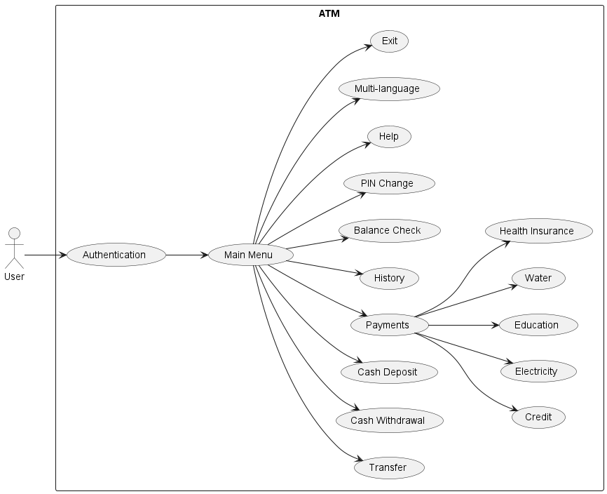

   <h1>Daspro-Project-ATM</h1>
    

## Overview 🚀
**"Daspro-Project-ATM"** is a project of making ATM (Automated Teller Machine) mechanism based on CLI (Command Line Interface). Daspro is stand for "Dasar Pemrograman" or basic programming in English. The goal of this project is how we can implement the concept of how a machine work like ATM into a programming. So we can really understand the workflow of a machine and try to think as a computer. In here, we use Java as the one and only programming language. 

> This project was done in the first semester at Informatics Politeknik Negeri Malang with the guidance of our beloved lecturers, Mrs. Triana Fatmawati ♥️

## Team 🔥

We are a team from informatics student Politeknik Negeri Malang, full of youthful ambition! 🔥

1. [Atabik Mutawakilalallah](https://github.com/AtabikM1)
2. [Farrel Augusta Dinata](https://github.com/FarrelAD)
3. [Innama Maesa Putri](https://github.com/sukinnamz)
      
## Timeline Work 📅
- START: 4 September 2023
- FINISH: 22 December 2023

We did this project incrementally. Whenever we learn something new in programming, we immediately implement it into our project. With new material introduced weekly, our project advances in complexity week by week.

All fun and challenges we've done while making this project. We always do learn something new and helping each other. So that, we can succeed this project. ✊

## Feature 👟
1. User authentication *(Autentikasi pengguna)*
2. Transfer
3. Cash withdrawal *(Tarik tunai)*
4. Cash deposit *(Setor tunai)*
5. Bill payments *(Pembayaran tagihan)*
6. PIN change *(Ubah PIN)*
7. Transaction history *(Riwayat transaksi)*
8. Help *(Bantuan)*
9. Multi language *(multi bahasa)*

## System flow ↩️

## Technical ⚙️
As said before, we always lern something new for every week. So, here are something that we have implemented into our project:

- Conditional statements
   - if... else...
   - nested if
   - switch-case
- Loop statements
   - do-while
   - while
   - for
- Array
   - basic array
   - multidimensional array
   - array list
- Function/method
   - basic method
   - recursive method

## Tools

| Name | Function |
|------|----------|
|  | Programming language. Without this, our project is nothing |
|  | Main text editor. Mostly we use this for coding until the project was done|
|  | Secondary text editor. [Farrel](https://github.com/FarrelAD) sometimes use this because it's lightweight |
| | Communicating. We often do the project online. So, really need this tool for communicating |
|  | Really useful when we have problem or stuck. |

